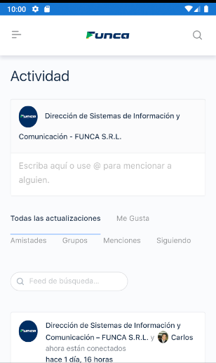
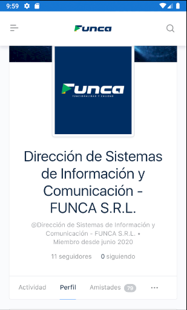

<!-- PROJECT LOGO -->
 

  

  <h3 align="center"> Academia Funca App</h3>

  

    Un pequeño proyecto para Academia Funca Bolivia, App crossPlatform webview con cache y cookies persistentes para prevenir ingreso de usuario/contraseña !
  
    <a href="https://github.com/Samleinav/AcademiaFuncaBolivia"><strong>Mira los archivos!»</strong></a>
 
 
  

<!-- TABLE OF CONTENTS -->

    
    
   
    
    
 

  
### Built With

* Xamarin Forms
* C# 
* Newtonsoft
